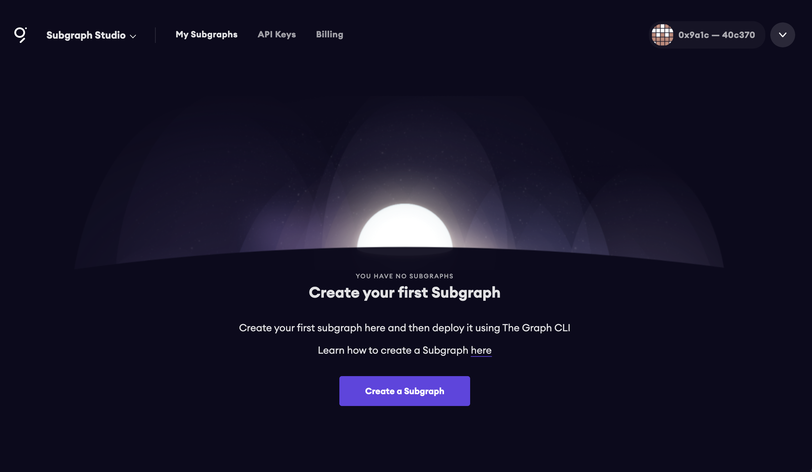
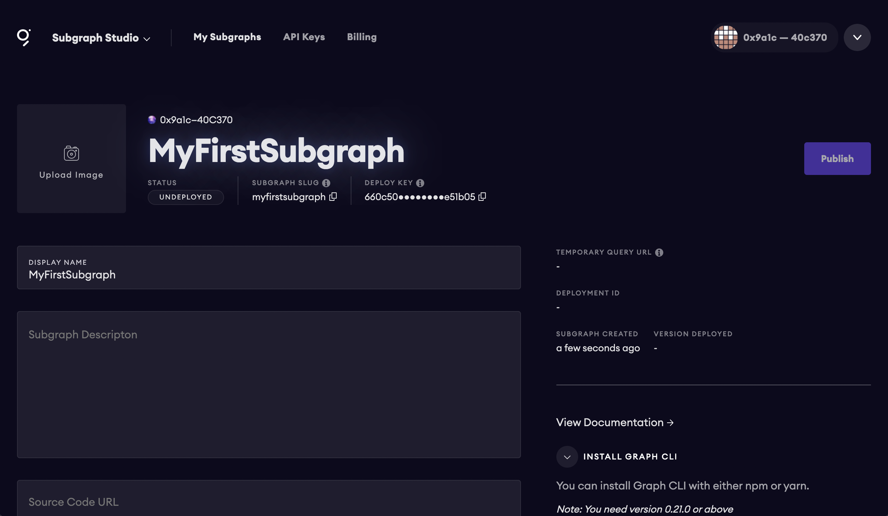
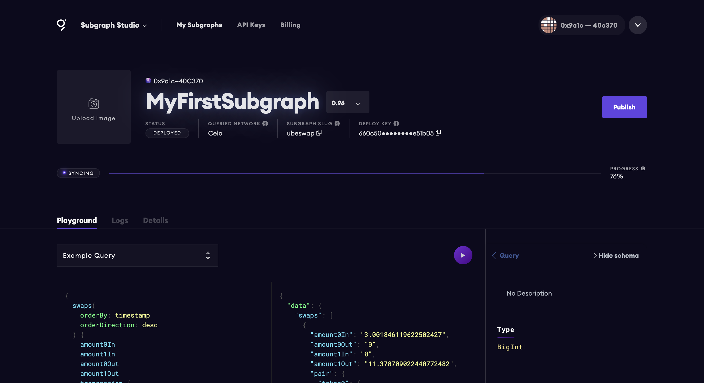

## The Graph - Subgraph Workshop

Learn how to build a GraphQL API on top of Celo to query data from [Ubeswap](https://github.com/Ubeswap/ubeswap).

In this workshop you'll learn how to build and deploy a subgraph using the [Ubeswap](https://github.com/Ubeswap/ubeswap) smart contract.

### Prerequisites

To be successful in this workshop, you should have [Node.js](https://github.com/nvm-sh/nvm#node-version-manager---) installed on your machine.

## Getting started

### Creating the Graph project in the Graph console

To get started, visit the Subgraph Studio at [https://thegraph.com/studio](https://thegraph.com/studio).

Here, click __Connect Wallet__ and choose a wallet address to authenticate. Once you’ve authenticated, you should be able to click __Create a Subgraph__ to create a new subgraph.



Here, give the subgraph a name and click __Continue__.

Next, you will see a view of your subgraph that enables you to add optional metadata like the subgraph description and image as well as view some useful information like the deploy key, slug, and status of the subgraph.



Now that your subgraph project has been created in the Studio, you can continue by going into your local development environment and opening your terminal.

### Initializing a new subgraph using the Graph CLI

Next, install the Graph CLI:

```sh
npm install -g @graphprotocol/graph-cli

# or

yarn global add @graphprotocol/graph-cli
```

Once the Graph CLI has been installed you can initialize a new subgraph with the Graph CLI `init` command.

In our project we'll be using the [UniswapV2Factory Contract](https://explorer.celo.org/address/0x62d5b84bE28a183aBB507E125B384122D2C25fAE/contracts) so we can initilize from that contract address:

```sh
graph init --contract-name Factory \
--index-events \
--product subgraph-studio \
--from-contract 0x62d5b84bE28a183aBB507E125B384122D2C25fAE 

? Subgraph name › your-subgraph-name-from-studio
? Directory to create the subgraph in › same as above (or your preferred folder name)
? Ethereum network › celo
? Contract address › 0x62d5b84bE28a183aBB507E125B384122D2C25fAE
? Contract Name · Token
```

<details>
<summary>If the CLI does not pull down the ABIs, open this menu and follow the enclosed steps</summary>
<br>

The CLI recently enabled support for Celo, but the ABIs may not be pulled down properly.

In this case, follow these steps to be successful:

1. Create a folder named __abis__ in an empty directory.

2. Download the 3 ABIs from [this directory](https://github.com/dabit3/ubeswap-subgraph-workshop/tree/main/abis) into your project.

3. Run this command again:

```sh
graph init --contract-name Factory \
--product subgraph-studio \
--from-contract 0x62d5b84bE28a183aBB507E125B384122D2C25fAE 

# You will be prompted for ABI File path:

ABI file (path): abis/Factory.json
Contract name: Factory
```

</details>

> Be sure that the __abis__ directory contains [these 3 abis](https://github.com/dabit3/ubeswap-subgraph-workshop/tree/main/abis). If they were not all pulled down, add them manually. The __subgraphname/abis__ directory should contain files named __ERC20.json__, __Factory.json__, and __Pair.json__.

This command will generate a basic subgraph based off of the contract address passed in as the argument to `--from-contract`. By using this contract address, the CLI should initialize a few things in your project to get you started (including fetching the `abis` and saving them in the __abis__ directory).

> By passing in `--index-events` the CLI will automatically populate some code for us both in __schema.graphql__ as well as __src/mapping.ts__ based on the events emitted from the contract.

The main configuration and definition for the subgraph lives in the __subgraph.yaml__ file. The subgraph codebase consists of a few files:

- __subgraph.yaml__: a YAML file containing the subgraph manifest
- __schema.graphql__: a GraphQL schema that defines what data is stored for your subgraph, and how to query it via GraphQL
- __AssemblyScript Mappings__: AssemblyScript code that translates from the event data in Ethereum to the entities defined in your schema (e.g. mapping.ts in this tutorial)

The entries in __subgraph.yaml__ that we will be working with are:

- `description` (optional): a human-readable description of what the subgraph is. This description is displayed by the Graph Explorer when the subgraph is deployed to the Hosted Service.
- `repository` (optional): the URL of the repository where the subgraph manifest can be found. This is also displayed by the Graph Explorer.
- `dataSources.source`: the address of the smart contract the subgraph sources, and the abi of the smart contract to use. The address is optional; omitting it allows to index matching events from all contracts.
- `dataSources.source.startBlock` (optional): the number of the block that the data source starts indexing from. In most cases we suggest using the block in which the contract was created.
- `dataSources.mapping.entities` : the entities that the data source writes to the store. The schema for each entity is defined in the the schema.graphql file.
- `dataSources.mapping.abis`: one or more named ABI files for the source contract as well as any other smart contracts that you interact with from within the mappings.
- `dataSources.mapping.eventHandlers`: lists the smart contract events this subgraph reacts to and the handlers in the mapping — __./src/mapping.ts__ in the example — that transform these events into entities in the store.

### Defining the entities

With The Graph, you define entity types in __schema.graphql__, and Graph Node will generate top level fields for querying single instances and collections of that entity type. Each type that should be an entity is required to be annotated with an `@entity` directive.

The entities / data we will be indexing are the `Token` and `User`. This way we can index the Tokens created by the users as well as the users themselves.

To do this, update __schema.graphql__ with the following code:

```graphql
type Token @entity {
  id: ID!
  symbol: String!
  name: String!
  decimals: BigInt!
}

type Transaction @entity {
  id: ID!
  blockNumber: BigInt!
  timestamp: BigInt!
  swaps: [Swap]!
}

type Pair @entity {
  id: ID!
  token0: Token!
  token1: Token!
  reserve0: BigDecimal!
  reserve1: BigDecimal!
  reserveUSD: BigDecimal!
  reserveCELO: BigDecimal!
  token0Price: BigDecimal!
  token1Price: BigDecimal!
  createdAtTimestamp: BigInt!
  createdAtBlockNumber: BigInt!
  swaps: [Swap!]! @derivedFrom(field: "pair")
}

type Swap @entity {
  id: ID!
  timestamp: BigInt!
  pair: Pair!
  transaction: Transaction!
  sender: Bytes!
  from: Bytes!
  amount0In: BigDecimal!
  amount1In: BigDecimal!
  amount0Out: BigDecimal!
  amount1Out: BigDecimal!
  to: Bytes!
  logIndex: BigInt
}
```

### On Relationships via `@derivedFrom` (from the docs):

Reverse lookups can be defined on an entity through the `@derivedFrom` field. This creates a virtual field on the entity that may be queried but cannot be set manually through the mappings API. Rather, it is derived from the relationship defined on the other entity. For such relationships, it rarely makes sense to store both sides of the relationship, and both indexing and query performance will be better when only one side is stored and the other is derived.

For one-to-many relationships, the relationship should always be stored on the 'one' side, and the 'many' side should always be derived. Storing the relationship this way, rather than storing an array of entities on the 'many' side, will result in dramatically better performance for both indexing and querying the subgraph. In general, storing arrays of entities should be avoided as much as is practical.

## Updating the subgraph with the entities and mappings

Now we can configure the __subgraph.yaml__ to use the entities that we have just created and configure their mappings.

To do so, first update the `dataSources.mapping.entities` field with the `User` and `Token` entities:

```yaml
entities:
  - Pair
  - Token
```

Next update the `abis` to include the ERC20 ABI along with the existing Factory ABI:

```yaml
abis:
  - name: Factory
    file: ./abis/Factory.json
  # add the below 2 lines
  - name: ERC20
    file: ./abis/ERC20.json
```

Next, update the dataSources.mapping.eventHandlers to include only the following event handler:

```yaml
eventHandlers:
  - event: PairCreated(indexed address,indexed address,address,uint256)
    handler: handleNewPair
```

Finally, update the configuration to add the `startBlock`. If you do not define a `startBlock`, the subgraph will begin indexing events from the [genesis block](https://www.investopedia.com/terms/g/genesis-block.asp).

```yaml
source:
  address: "0x62d5b84be28a183abb507e125b384122d2c25fae"
  abi: Token
  startBlock: 5272596
```

The final __subgraph.yml__ should look like this:

```yml
specVersion: 0.0.2
schema:
  file: ./schema.graphql
dataSources:
  - kind: ethereum/contract
    name: Factory
    network: celo
    source:
      address: "0x62d5b84be28a183abb507e125b384122d2c25fae"
      abi: Factory
      startBlock: 5272596
    mapping:
      kind: ethereum/events
      apiVersion: 0.0.4
      language: wasm/assemblyscript
      entities:
        - Pair
        - Token
      abis:
        - name: Factory
          file: ./abis/Factory.json
        - name: ERC20
          file: ./abis/ERC20.json
      eventHandlers:
        - event: PairCreated(indexed address,indexed address,address,uint256)
          handler: handleNewPair
      file: ./src/mapping.ts
```

## Adding additional contracts

A common pattern in smart contracts is the use of registry or factory contracts, where one contract creates, manages or references an arbitrary number of other contracts that each have their own state and events. The addresses of these sub-contracts may or may not be known upfront and many of these contracts may be created and/or added over time. This is why, in such cases, defining a single data source or a fixed number of data sources is impossible and a more dynamic approach is needed: data source templates.

First, you define a regular data source for the main contract. In our case, the Factory contract. Note the `PairCreated` event handler. This is emitted when a new pair is created on chain by the factory contract.

Next, you add data source templates to the manifest. These are identical to regular data sources, except that they lack a predefined contract address under source. Typically, you would define one template for each type of sub-contract managed or referenced by the parent contract.

Add the following code to `subgraph.yaml`:

```yaml
templates:
  - kind: ethereum/contract
    name: Pair
    network: celo
    source:
      abi: Pair
    mapping:
      kind: ethereum/events
      apiVersion: 0.0.4
      language: wasm/assemblyscript
      file: ./src/mapping.ts
      entities:
        - Pair
        - Token
      abis:
        - name: Pair
          file: ./abis/pair.json
        - name: Factory
          file: ./abis/Factory.json
      eventHandlers:
        - event: Swap(indexed address,uint256,uint256,uint256,uint256,indexed address)
          handler: handleSwap
```

In this template, because the `Factory` contract inherits the `Pair` contract, we are able to handle transactions and events from the inherited contract.

## Code generation

Now that we have created the GraphQL schema and the configuration for our API, we can use the CLI to generate entities locally to start using in the mapping templates for the event handlers:

```sh
graph codegen
```

In order to make working smart contracts, events and entities easy and type-safe, the Graph CLI generates [AssemblyScript](https://www.assemblyscript.org/) types from a combination of the subgraph's GraphQL schema and the contract ABIs included in the data sources.

This code will contain methods and types for interacting with both the Graph node as well as the smart contract itself.

## Assemblyscript mappings

Next, open __src/mappings.ts__ to write the mappings that we defined in our subgraph subgraph `eventHandlers`.

Update the file with the following code:

```typescript
import { Address, BigDecimal, BigInt } from "@graphprotocol/graph-ts";
import {
  Pair,
  Swap as SwapEvent,
  Token,
  Transaction,
} from "../generated/schema";

import {
  Swap,
} from "../generated/templates/Pair/Pair";

import {
  PairCreated,
} from '../generated/Factory/Factory'

import {
  ERC20
} from '../generated/Factory/ERC20'

import {
  Pair as PairTemplate 
} from '../generated/templates'

import { log } from '@graphprotocol/graph-ts'

let ZERO_BI = BigInt.fromI32(0);
let ONE_BI = BigInt.fromI32(1);
const CELO_ADDRESS = "0x471ece3750da237f93b8e339c536989b8978a438";

export function exponentToBigDecimal(decimals: BigInt): BigDecimal {
  let bd = BigDecimal.fromString("1");
  for (let i = ZERO_BI; i.lt(decimals as BigInt); i = i.plus(ONE_BI)) {
    bd = bd.times(BigDecimal.fromString("10"));
  }
  return bd;
}

export function fetchTokenSymbol(tokenAddress: Address): string {
  if (tokenAddress.toHexString() == CELO_ADDRESS) {
    return "CELO";
  }
  let contract = ERC20.bind(tokenAddress);
  let symbolValue = "unknown";
  let symbolResult = contract.try_symbol();
  if (!symbolResult.reverted) {
    symbolValue = symbolResult.value;
  }
  return symbolValue;
}

export function fetchTokenDecimals(tokenAddress: Address): BigInt {
  if (
    tokenAddress.toHexString() == "0x7fc66500c84a76ad7e9c93437bfc5ac33e2ddae9"
  ) {
    return BigInt.fromI32(18);
  }
  let contract = ERC20.bind(tokenAddress);
  let decimalValue = null;
  let decimalResult = contract.try_decimals();
  if (!decimalResult.reverted) {
    decimalValue = decimalResult.value;
  }
  return BigInt.fromI32(decimalValue);
}

export function convertTokenToDecimal(
  tokenAmount: BigInt,
  exchangeDecimals: BigInt
): BigDecimal {
  if (exchangeDecimals == ZERO_BI) {
    return tokenAmount.toBigDecimal();
  }
  return tokenAmount.toBigDecimal().div(exponentToBigDecimal(exchangeDecimals));
}

export function fetchTokenName(tokenAddress: Address): string {
  if (tokenAddress.toHexString() == CELO_ADDRESS) {
    return "Celo Native Asset";
  }
  let contract = ERC20.bind(tokenAddress);
  let nameValue = "unknown";
  let nameResult = contract.try_name();
  if (!nameResult.reverted) {
    nameValue = nameResult.value;
  }

  return nameValue;
}

export function handleSwap(event: Swap): void {
  log.debug("This is a swap", [event.transaction.hash.toHexString()]);
  let transaction = Transaction.load(event.transaction.hash.toHexString());
  if (transaction === null) {
    transaction = new Transaction(event.transaction.hash.toHexString());
    transaction.blockNumber = event.block.number;
    transaction.timestamp = event.block.timestamp;
    transaction.swaps = [];
  }
  let swaps = transaction.swaps;
  let swap = new SwapEvent(
    event.transaction.hash
      .toHexString()
      .concat("-")
      .concat(BigInt.fromI32(swaps.length).toString())
  );

  let pair = Pair.load(event.address.toHexString());
  let token0 = Token.load(pair.token0);
  let token1 = Token.load(pair.token1);

  let amount0In = convertTokenToDecimal(
    event.params.amount0In,
    token0.decimals
  );
  let amount1In = convertTokenToDecimal(
    event.params.amount1In,
    token1.decimals
  );
  let amount0Out = convertTokenToDecimal(
    event.params.amount0Out,
    token0.decimals
  );
  let amount1Out = convertTokenToDecimal(
    event.params.amount1Out,
    token1.decimals
  );

  swap.transaction = transaction.id;
  swap.pair = pair.id;
  swap.timestamp = transaction.timestamp;
  swap.transaction = transaction.id;
  swap.sender = event.params.sender;
  swap.amount0In = amount0In
  swap.amount1In = amount1In;
  swap.amount0Out = amount0Out;
  swap.amount1Out = amount1Out;
  swap.to = event.params.to;
  swap.from = event.transaction.from;
  swap.logIndex = event.logIndex;

  swap.save();
  swaps.push(swap.id);
  transaction.swaps = swaps;
  transaction.save();  
}

export function handleNewPair(event: PairCreated): void {
  let token0 = Token.load(event.params.token0.toHexString());
  let token1 = Token.load(event.params.token1.toHexString());

  if (token0 === null) {
    token0 = new Token(event.params.token0.toHexString());
    token0.symbol = fetchTokenSymbol(event.params.token0);
    token0.name = fetchTokenName(event.params.token0);
    let decimals = fetchTokenDecimals(event.params.token0);
    if (decimals === null) {
      return;
    }

    token0.decimals = decimals;
  }

  if (token1 === null) {
    token1 = new Token(event.params.token1.toHexString());
    token1.symbol = fetchTokenSymbol(event.params.token1);
    token1.name = fetchTokenName(event.params.token1);
    let decimals = fetchTokenDecimals(event.params.token1);

    if (decimals === null) {
      return;
    }
    token1.decimals = decimals;
  } 
  
  let pair = new Pair(event.params.pair.toHexString()) as Pair;
  pair.token0 = token0.id;
  pair.token1 = token1.id;
  pair.createdAtTimestamp = event.block.timestamp;
  pair.createdAtBlockNumber = event.block.number;

  PairTemplate.create(event.params.pair);
  
  token0.save();
  token1.save();
  pair.save();
}
```

These mappings will handle events for when a new pair is created or when a new swap happens. When these events fire, the mappings will save the data into the subgraph.

### Running a build

Next, let's run a build to make sure that everything is configured properly. To do so, run the `build` command:

```sh
graph build
```

If the build is successful, you should see a new __build__ folder generated in your root directory.

## Deploying the subgraph

Now that the subgraph is completed, it’s ready to be deployed to the Studio for testing.

Before we deploy, we first need to authenticate. To do so, open Subgraph Studio dashboard for the subgraph you created and copy the `DEPLOY KEY` to your clipboard.

Next, open your CLI and run the following command:

```sh
graph auth --studio
```

When prompted, paste in your `DEPLOY KEY`.

Now you can deploy your subgraph using the deploy command:

```sh
graph deploy --studio <subgraph-name>
```

When prompted for a version label, choose a version for the subgraph.

Once the subgraph is deployed, the Studio should update with a new UI allowing you to test queries in the GraphQL playground as well as view logs and other details.



## Querying for data

Now that we are in the dashboard, we should be able to start querying for data. Run the following query to get a list of tokens and their metadata:

```graphql
{
  tokens {
    id
    symbol
    name
    decimals
  }
}

```

We can also query pairs:

```graphql
{
  pairs {
    createdAtTimestamp
    token0 {
      name
    }
    token1 {
      name
    }
  }
}

```

Swaps:

```graphql
{
  swaps {
    amount0In
    amount1In
    amount0Out
    amount1Out
    transaction {
      id
      blockNumber
    }
    pair {
      token0 {
        name
      }
      token1 {
        name
      }
    }
  }
}
```

We can also query by timestamp to view the most recently created swaps:

```graphql
{
  swaps(
    orderBy: timestamp
    orderDirection: desc
  ) {
    amount0In
    amount1In
    amount0Out
    amount1Out
    transaction {
      id
      blockNumber
    }
    pair {
      token0 {
        name
      }
      token1 {
        name
      }
    }
  }
}
```

## Next steps

Next, you may want to publish your subgraph to the decentralized network.

To learn how to do this, check out the tutorial [here](https://thegraph.com/blog/building-with-subgraph-studio) and the video [here](https://www.youtube.com/watch?v=HfDgC2oNnwo).


## Main Ubeswap Subgraph

To see the full implementation of the [Ubeswap Subgraph](https://thegraph.com/legacy-explorer/subgraph/ubeswap/ubeswap), check out the repo [here](https://github.com/Ubeswap/ubeswap-subgraph)